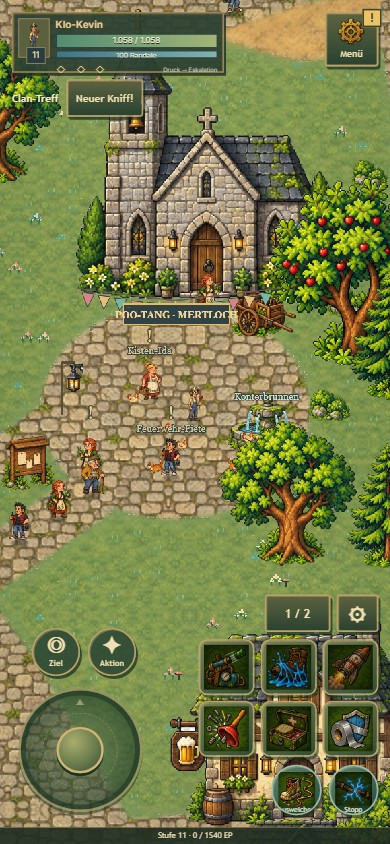
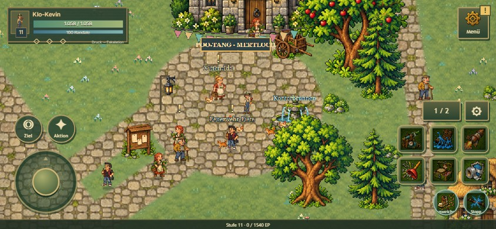
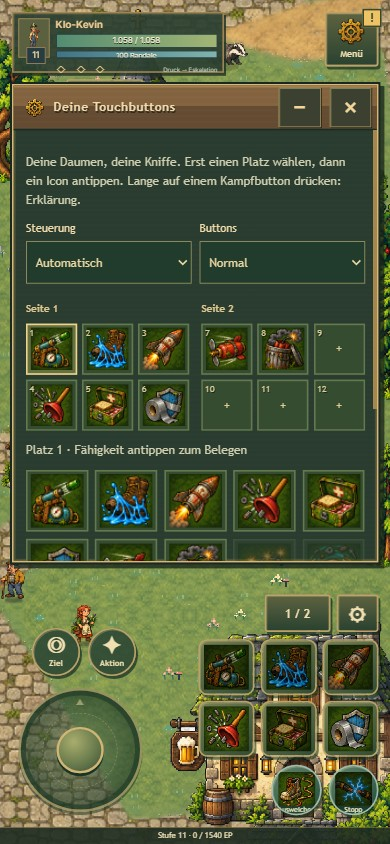

# Mobile Ausgabe 0.14

## Bedienung

Das Spiel erkennt mobile Browser, Touch-Hardware und primär grobe Zeiger. Ein nur schmal gezogenes Desktopfenster erzwingt keinen Handy-Modus. Unter **Menü → Steuerung** kannst du Automatisch, Touch oder Maus & Tastatur wählen. Diese Auswahl wird lokal gespeichert; Smartphones und Tablets funktionieren in Hoch- und Querformat.

- Links: Joystick halten und ziehen. Kleine Ausschläge bewegen langsamer, eine Totzone verhindert Drift. Loslassen bremst weich. Alternativ freien Boden antippen, um dorthin zu laufen.
- Rechts: sechs große Skillknöpfe pro Seite. **1 / 2** wechselt die Seite; **⚙** öffnet die Belegung. Platz auswählen, dann ein gelerntes Skill-Icon antippen. Vorhandene Belegungen tauschen, keine doppelten Skills. Größe und zwölf Plätze werden pro Figur gespeichert, getrennt von der Desktop-Leiste. Neu gelernte Fähigkeiten belegen freie Plätze; absichtlich geleerte Plätze bleiben bis zur nächsten neuen Fähigkeit leer.
- Ausweichen und Unterbrechen bleiben separat. Der Unterbrechungsknopf erscheint nach dem Lernen. Zwei Finger funktionieren gleichzeitig, auch wenn einer früher losgelassen wird. Normaler GCD und Abklingzeiten gelten weiterhin.
- **Ziel** wählt einen nahen passenden Gegner. Gegner lassen sich auch direkt antippen. **Aktion** spricht mit Personen, öffnet Beute oder bedient eine nahe Spielstation. Beim Rhythmusspiel wird daraus **Takt**.
- Bodenfähigkeit antippen, dann auf freien Boden in Reichweite tippen. **Zielen abbrechen** beendet die Auswahl.
- Einen Kampfskill etwa eine halbe Sekunde halten: Erklärung öffnen, ohne ihn auszulösen. Das Skillbuch zeigt Erklärungen beim Antippen. **Menü** enthält Inventar, Charakter, Talente, Aufträge, Karte, Hilfe, Steuerung, Installation, Ton, Vollbild und Admin.

Fenster pausieren die Spielwelt nicht. Die Touchsteuerung bleibt erreichbar; weitere geöffnete Fenster liegen dahinter und können über das Menü wieder aufgerufen werden. Der mobile Bildausschnitt zeigt mehr Umgebung. Displayränder verwenden die Safe-Area-Abstände des Browsers.

## Installation und Offline-Start

Die öffentliche HTTPS-Adresse ist [er-esm.github.io/mertloch-chronicles](https://er-esm.github.io/mertloch-chronicles/). **Menü → Als App** verwendet den nativen Installationsdialog, wenn der Browser ihn anbietet. Andernfalls stehen dort die manuellen Schritte. Auf iPhone/iPad: in Safari öffnen, Teilen → Zum Home-Bildschirm, gegebenenfalls „Als Web-App öffnen“, anschließend über das Poo-Tang-Symbol starten. Der Browser entscheidet über das Installationsangebot. [MDN: Installation einer PWA](https://developer.mozilla.org/en-US/docs/Web/Progressive_web_apps/Guides/Making_PWAs_installable)

Das Manifest verlangt `fullscreen` mit `standalone` als Alternative. Die installierte App startet ohne normale Browsernavigation; das Betriebssystem kann eine Status- oder Gestenleiste behalten. Die iOS-Installation ist deshalb kein Versprechen, sämtliche Systemleisten ausblenden zu können. [web.dev: Manifest und Darstellungsmodi](https://web.dev/learn/pwa/web-app-manifest), [web.dev: Besonderheiten von Apple-Plattformen](https://github.com/GoogleChrome/web.dev/blob/main/src/site/content/en/learn/pwa/enhancements/index.md)

Beim ersten vollständigen Online-Aufruf speichert der Service Worker Anwendung, Karte und benötigte Grafikdateien. Im Menü steht anschließend **Offline bereit**. Danach funktionieren neue Starts ohne Netz. Fortschritt und Touch-Einstellungen liegen lokal, ohne Cloud-Synchronisierung. Browser und installierte App können je nach Plattform getrennte Speicherbereiche haben.

Jeder Release besitzt einen Inhalts-Hash und einen vollständigen eigenen Cache. Ein neuer Cache wird erst nach erfolgreichem Laden aller Dateien aktiviert. Eine laufende Partie erhält einen Updateknopf; dessen Betätigung speichert zuerst, wechselt auf die neue Version und lädt neu. Alte und neue Module werden nicht gemischt. Andere Cache-Namen und Spielstände werden nicht gelöscht.

`npm run build` erzeugt `precache-manifest.js`, kopiert Manifest, Service Worker, PNG-App-Symbole und Anwendung nach `_site/`. Alle URLs sind relativ; GitHub-Pages-Unterverzeichnisse sind unterstützt. Das App-Symbol stammt aus dem eigenen SVG-Pixelemblem unter `assets/app/icon.svg`; `scripts/build-app-icons.mjs` rastert es in 192, 512 und 180 Pixel sowie eine Maskable-Variante.

## Prüfungen und Grenzen

`scripts/mobile-review.mjs` verwendet echte emulierte Touch-Ereignisse in Chromium. Geprüfte Ansichten: 390×844, 844×390, 360×740, 768×1024 und 1024×768. Zusätzlich wurden Displayaussparungen mit 44 Pixeln oben bzw. seitlich und 34/21 Pixeln Gestenabstand emuliert. Lange Berührung öffnet eine Erklärung, ohne den Skill zu aktivieren. Geprüft sind automatische Erkennung, Umschaltung, Touchbelegung mit Neuladen, getrennte Desktopbelegung, Bodenplatzierung, Joystick mit zweitem Finger für Ausweichen, Anhalten nach Loslassen und Inventar während laufender Bewegung.

`scripts/mobile-combat.mjs` läuft mit Touch-Eingaben über eine echte Kartenroute zum Gegnerlager und kämpft mit offenem Inventar. Die Testfigur ist Kevin auf Stufe 6 mit Startausrüstung. Nach dem Laden des Ausgangsspielstands wird der Spielzustand nur gelesen; Aktionen erfolgen über die Oberfläche.

`scripts/pwa-review.mjs` prüft unter einem Pages-Unterpfad Manifest und Chrome-Installierbarkeitskriterien, einen neuen Seitenstart mit abgeschaltetem Netzwerk, Grafik-/Skillbuchdarstellung, Bewegung sowie einen simulierten zweiten Release mit wartendem Update und anschließendem Cachewechsel. Spielstände bleiben erhalten. Automatisierte Tests decken außerdem Geräteerkennung, Belegung, Stufenfilter, Analogbewegung und Icongrößen ab.

Die Screenshots wurden selbst auf verdeckte Knöpfe, Überläufe und verfügbare Spielfläche geprüft. Das sind Browser-Emulationen, keine Tests auf einem physischen iPhone oder Android-Gerät. Systemgesten, native Installationsdialoge und Leistung auf schwacher Hardware können sich unterscheiden.

Weitere Bilder und maschinenlesbare Ergebnisse: `progression-review/mobile-014/`.
