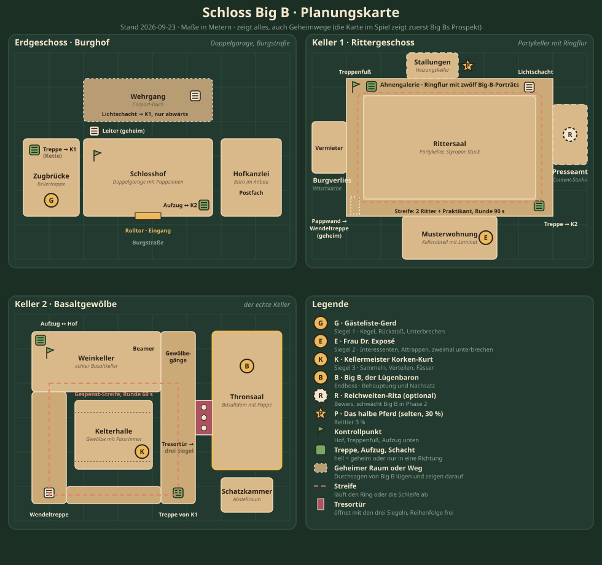

# Erster Dungeon „Schloss Big B" · Planung 2026-09-23, zweite Fassung

Anlass: Auftrag „Plane und bereite den ersten Dungeon vor mit allem was dazu gehört, mit mehreren Bossen, Trash etc. Der
Endboss ist Big B, der Lügenbaron." Nachauftrag am selben Tag: „Plane auch die anderen Bosse. Der Dungeon an sich sollte
ggf. nicht nur Raum für Raum sein. Außerdem soll es eine Dungeonmap geben." Grundlage: der Meilenstein „Dungeons" aus
[E-45](ENTSCHEIDUNGEN.md), die offenen Punkte „Dungeon-Merkmale" in [backlog/engine.md](backlog/engine.md) und
[backlog/gameplay.md](backlog/gameplay.md), Stand `main` 085c15f.
**Stand:** Planung, nichts entschieden; Entscheidungen trifft die Produktion ([ENTSCHEIDUNGEN.md](ENTSCHEIDUNGEN.md)).
Alle Zahlen sind Entwürfe für Balancing (`content/tuning.js`, Balance-Sheet E-57). Alle Spielertexte sind Beispiele im Ton
E-20 und werden von Story ersetzt oder abgenommen. Vorschläge heißen V-D1 bis V-D11; die E-Nummer vergibt der Lead.



**Kurzfassung.** Der erste Dungeon heißt „Schloss Big B" und ist in Wahrheit eine gemietete Doppelgarage an der
Burgstraße mit zwei Kellergeschossen, das untere ein echter alter Basaltkeller. Big B, selbsternannter Freiherr und
Immobilien-Influencer, behauptet, ihm gehöre das halbe Maifeld, jetzt auch das Grundstück der Bude. Der Dungeon ist
**nicht linear**: drei Ebenen um einen Hof als Knotenpunkt, ein Ringgang mit Streife, ein Geheimweg über das Carport-Dach,
eine versteckte Wendeltreppe hinter einer Pappwand und ein Getränkeaufzug als Abkürzung. Die Tür zum Thronsaal hat drei
Siegel; die drei Leute von Big B tragen je eins, die Reihenfolge ist frei. Wer erkundet, findet drei **Beweise** gegen
Big B und kann seine Social-Media-Managerin stellen; beides macht den Endkampf leichter. Big Bs Lautsprecher-Durchsagen
lügen, und wer sie umdreht, findet die Geheimnisse. Die **Dungeon-Karte** im Spiel zeigt zunächst Big Bs Hochglanz-Prospekt
mit Türmen und Burggraben; beim Erkunden zeichnet sich darüber die Wirklichkeit ein. Sechs Bosse: Gästeliste-Gerd,
Frau Dr. Exposé und Kellermeister Korken-Kurt als Siegelträger, Reichweiten-Rita als optionaler Boss, das halbe Pferd
als seltener Boss, Big B als Endboss mit der Kernmechanik **Behauptung und Nachsatz**. Fünf Köpfe, Stufe 8 bis 10,
kürzester Weg rund 25 Minuten, voller Durchgang rund 45 Minuten, spielbar mit Menschen oder Söldnern.

## 1 · Ausgangslage im Repo

| Baustein | Stand heute | Beleg |
|---|---|---|
| Instanzen | genau eine: Kalles Kiosk als eigener begehbarer Raum (`g.instance`, eigene Kollision, Wegfindung, Ein- und Austritt); die Bude ist begehbar im Echtmaßstab mit Obergeschoss (E-52, E-54) | `kiosk-instance.js`, E-52, E-54 |
| Zaubermuster | `CAST_SETS`: Zyklus aus Zaubern mit `total`, `damage`, `radius`, `ground`, `interruptible` | `content/enemies.js`, `engine.js` `startCast` |
| Boss-Phasen | nur Sprüche an Lebensschwellen, keine neuen Fähigkeiten | `content/enemies.js` `BOSSES` |
| Adds, Kegel, Linien, Sammeln, Verteilen, Rückstoß | nicht vorhanden | Engine liest nur `radius`, `ground`, `interruptible`, `damage`, `target` |
| Söldner | Rollen Schutz, Heilung, Schaden; reagieren auf `ground` und `interruptible`; höchstens vier, mit Menschen höchstens fünf Köpfe | E-45, `docs/BEGLEITER-2026-09-21.md` |
| Gruppenspiel online | geteilte Gegner mit Bedrohung, Bedarf/Gier, Gruppen-Buffs, Weltbosse | E-35, E-42, E-44 |
| Karte | Weltkarte mit Orten, Auftragszielen und Wegmarke; Minikarte im HUD | `atlas-ui.js`, `cartography.js`, `hotspots.js`, `app.js` |
| Beute | Gegenstandsstufe = Fundstufe, Güte, Dorflegenden ×1,25, Zusatz-Generator | E-40, E-56 |
| Aufträge | Hotspots, Sammeln über Drops, Karte mit Zielgebieten | E-55 |
| Grafik | Sprite-Baukasten mit Obergeschoss, Sprite-Schmiede, Bilder direkt aus der Sitzung | E-51, E-54, E-58 |

## 2 · Leitidee: Der Dungeon ist eine Lüge mit Nachsatz

E-20 verlangt für jede Zeile: erst die Behauptung, dann der Nachsatz, der sie kaputt macht. Big B ist diese Regel als
Person, und der Dungeon folgt ihr überall:

1. **Jeder Raum hat ein Schild und eine Wirklichkeit.** „Rittersaal" steht an der Tür, drin ist ein Partykeller.
2. **Die Karte lügt, bis man nachsieht.** Die Dungeon-Karte zeigt zuerst den Prospekt, Erkunden deckt die Wahrheit auf.
3. **Die Durchsagen lügen, und das hilft.** „Hier gibt es keinen Geheimgang" heißt: Hier gibt es einen.
4. **Die Wahrheit ist eine Waffe.** Wer Beweise findet und Big Bs Pressefrau stellt, macht ihn im Endkampf schwächer.
5. **Jede Mechanik lehrt, auf den Nachsatz zu achten.** Grundlagen bei Gerd, Attrappen und Doppelunterbrechen bei Exposé,
   Absprache bei Korken-Kurt, Deckung bei Rita, und Big B lügt bei jeder großen Ansage.
6. **Das einzig Echte ist der Keller.** Der Basaltdom ganz unten ist wirklich beeindruckend. Big B hat ihn mit Pappe verkleidet.

## 3 · Rahmen

| Punkt | Vorschlag | Begründung |
|---|---|---|
| Name | **Schloss Big B**, Untertitel „Doppelgarage mit Kellerabgang, Burgstraße" | Behauptung und Nachsatz im Namen |
| ID | `schloss-bigb` (Speicherschlüssel, E-04) | kurz, eindeutig |
| Stufe | Eintritt ab 8, Gegner 8 bis 10, Big B Stufe 10 | nach Akt 1 (Timo Stufe 7) |
| Gruppe | fünf Köpfe: ein Schutz, eine Heilung, drei Schaden; Menschen oder Söldner gemischt | E-45 |
| Dauer | kürzester Weg rund 25 Minuten, voller Durchgang rund 45 Minuten | Wahl zwischen schnell und gründlich |
| Schwierigkeit | nur „Normal"; Heldenmodus später | erst Grundlagen |
| Zugang | nach Kapitel 4 von Akt 1 und Stufe 8; Eingang in der Welt | Akt 1 bleibt die Basis (E-16) |
| Story | Nebenstrang nach Akt 1, ohne Bastian, Hochzeit oder Koblenz | E-22 sperrt Akt 2, nicht einen Nebenstrang |
| Sperre | keine; Beute über Chance | erster Dungeon soll wiederholt werden |
| Tod | alle tot: zurück zum nächsten Kontrollpunkt in der Instanz, Boss setzt zurück, erlegter Trash bleibt liegen | weniger Frust |

**E-20-Prüfung für „Big B".** Big B ist eine erfundene Figur, ein Typus (Hochstapler, Immobilien-Influencer, „Freiherr"
von der Kirmes). Story prüft vor dem Einbau, dass weder Name noch Aussehen eine reale Person aus der Gegend erkennbar
machen. „Lügenbaron" spielt auf Münchhausen an; dessen Geschichten (Kanonenkugelritt, am eigenen Schopf aus dem Sumpf, das
halbe Pferd) sind gemeinfrei.

**Ort.** Die Weltdaten kennen die Burgstraße. Big B: „Die heißt so, weil da meine Burg steht." Da steht eine Doppelgarage.
Ausweichort, falls die Welt dort keinen Platz hat: „Am Bahnhof" (ein altes Lagerhaus). Kein reales Unternehmen im Text;
der Raiffeisen-Markt aus den OSM-Daten bleibt unerwähnt (E-20).

## 4 · Aufbau: drei Ebenen, freie Reihenfolge

### 4.1 Grundriss

Drei Ebenen, jede rund 64 × 48 m (die Planungskarte oben zeigt alles, auch die Geheimnisse):

- **Erdgeschoss „Burghof"** (die Garage): Hof als Knotenpunkt mit Kontrollpunkt, links die Zugbrücke (Kellertreppe mit
  Gerd), rechts die Verwaltung (Büro im Anbau), oben über eine Leiter der Wehrgang auf dem Carport-Dach (geheim).
- **Keller 1 „Rittergeschoss"** (der Partykeller): ein **Ringgang**, die Ahnengalerie, läuft um den Rittersaal herum.
  Vom Ring gehen ab: Stallungen (seltener Boss), Content-Studio (Rita), Burgverlies (der eingesperrte Vermieter),
  Musterwohnung (Exposé). Zwei Wege nach unten: die Haupttreppe und eine Wendeltreppe hinter einer Pappwand (geheim).
- **Keller 2 „Basaltgewölbe"** (der echte Keller): Weinkeller und Gewölbegänge bilden eine **Schleife** mit
  Gespenst-Streife. An der Schleife liegen die Kelterhalle (Korken-Kurt), der Getränkeaufzug (Abkürzung nach oben) und die
  Tresortür mit drei Siegeln. Dahinter der Thronsaal im Basaltdom und die Schatzkammer.

| Ebene | Raum (`id`) | Schild | Wirklichkeit | Inhalt | Art |
|---|---|---|---|---|---|
| E0 | `hof` | Schlosshof | Doppelgarage mit Pappzinnen auf dem Carport | 2 Gruppen, Pappwachen, Kontrollpunkt | Pflicht |
| E0 | `zugbruecke` | Zugbrücke | Kellertreppe mit Kette und Vorhängeschloss | **Gästeliste-Gerd** | Siegel 1 |
| E0 | `verwaltung` | Hofkanzlei | Büro im Anbau: Aktenordner, Faxgerät, Kaffeemaschine | 2 Gruppen, Postfach (Auftrag) | frei |
| E0 | `wehrgang` | Wehrgang | Carport-Dach über eine Leiter, Lichtschacht nach unten | Pappschützen, Beweis „Leihschein" | geheim |
| K1 | `galerie` | Ahnengalerie | Ringflur mit zwölf Porträts, alle Big B mit anderer Perücke | Streife (2 Ritter + Praktikant), Kontrollpunkt | Pflicht |
| K1 | `rittersaal` | Rittersaal | Partykeller mit Styropor-Stuck und Dartscheibe | 3 Gruppen | frei |
| K1 | `stall` | Stallungen | Heizungskeller mit Schaukelpferd und Hafersack | **das halbe Pferd** (30 %) | selten |
| K1 | `studio` | Presseamt | Content-Studio: Greenscreen, Ringlichter, Palettensofa | **Reichweiten-Rita** | optional |
| K1 | `verlies` | Burgverlies | Waschküche, Tür mit Fahrradschloss | 3 Wachen, eingesperrter Vermieter | Ereignis |
| K1 | `musterwohnung` | Musterwohnung · Besichtigung | Kellerabteil mit Laminat und Duftstäbchen | **Frau Dr. Exposé** | Siegel 2 |
| K2 | `weinkeller` | Weinkeller | echter Basaltkeller, Tetrapaks in Holzkisten, Sprinkleranlage | Rattenschwärme, Beamer, Aufzug unten | Pflicht |
| K2 | `gewoelbe` | Gewölbegänge | alte Basaltgänge, feucht, schön | Gespenst-Streife | Pflicht |
| K2 | `kelterhalle` | Kelterhalle | Gewölbe mit drei Rinnen für Fässer | **Kellermeister Korken-Kurt** | Siegel 3 |
| K2 | `tresor` | Tresortür | Stahltür mit drei aufgeklebten Siegelfeldern | braucht drei Siegel | Tor |
| K2 | `thronsaal` | Thronsaal | echter Basaltdom, verkleidet mit Pappkulissen, Thron aus Bierkisten | **Big B** | Endboss |
| K2 | `schatz` | Schatzkammer | Abstellraum mit Truhe und goldlackierten Kronkorken | Beute, Ausgang | Abschluss |

### 4.2 Wege und Reihenfolge

Pflicht sind nur die drei Siegel und Big B. Die Reihenfolge der Siegelträger ist frei, weil es zwei Wege nach unten gibt:

- **Hauptweg:** Hof → Zugbrücke (Gerd, danach öffnet die Kette) → Ahnengalerie → Musterwohnung (Exposé) → Haupttreppe →
  Weinkeller → Kelterhalle (Korken-Kurt) → Tresortür → Thronsaal (Big B). Rund 25 Minuten.
- **Über das Dach:** Hof → Leiter → Wehrgang (Beweis „Leihschein") → Lichtschacht (nur abwärts) → Ahnengalerie. Umgeht
  Gerds Kette. Gerd muss trotzdem fallen, für sein Siegel; man holt ihn später über den Getränkeaufzug oder die
  Haupttreppe nach, die von unten ohne Kette begehbar ist.
- **Voller Durchgang:** zusätzlich Verwaltung, Burgverlies (Vermieter befreien, Beweis „Mietvertrag", Aufzugschlüssel),
  Stallungen (seltener Boss), Presseamt (Rita, Beweis „Kirmes-Urkunde"), Wendeltreppe, alle Grundbuchauszüge. Rund 45 Minuten.

Beispiel für eine freie Reihenfolge: Dach → Rita → Exposé → Wendeltreppe → Korken-Kurt → Aufzug hoch → Gerd → Aufzug
runter → Big B. Jede Reihenfolge endet am Tresor.

### 4.3 Tore, Geheimnisse, Abkürzungen

| Element | Wo | Wie | Folge |
|---|---|---|---|
| Kette an der Kellertreppe | Zugbrücke | fällt, wenn Gerd fällt; von unten immer offen | Hauptweg nach unten |
| Leiter zum Wehrgang | Hof, hinter dem Carport-Pfosten | F an der Leiter; im Prospekt steht dort ein „Nordturm" | Geheimweg, Beweis |
| Lichtschacht | Wehrgang → Ahnengalerie | nur abwärts | umgeht Gerd |
| Pappwand | Ahnengalerie Südwest | F „Pappwand eindrücken"; Durchsage „Hier gibt es KEINEN Geheimgang." | Wendeltreppe nach K2 |
| Getränkeaufzug | Weinkeller ↔ Hof | Schlüssel vom Vermieter, oder von unten mit Hebel nach Korken-Kurt | Abkürzung, Kontrollpunkt unten |
| Tresortür | Gewölbegang Ost | drei Siegel (Gerd, Exposé, Korken-Kurt) | Weg zu Big B |
| Burgverlies | Ahnengalerie West | drei Wachen, dann F „Fahrradschloss knacken" | Vermieter frei |

Kontrollpunkte: Hof (E0), Treppenfuß in der Ahnengalerie (K1), Aufzug unten (K2, sobald offen). Nach einem Gruppentod
geht es zum nächstgelegenen erreichten Kontrollpunkt.

### 4.4 Ereignisse unterwegs

- **Durchsagen.** Big B spricht über Lautsprecher. Jede Durchsage ist gelogen und zeigt, richtig gelesen, auf etwas Wahres:

| Auslöser | Durchsage (Behauptung) | Wahrheit |
|---|---|---|
| Hof betreten | „Willkommen! Der Keller ist gesperrt. Einsturzgefahr." | der Keller ist das Ziel |
| Vor der Leiter | „Das Dach ist nur Deko. Betreten verboten." | oben liegt ein Beweis |
| Pappwand | „Hier gibt es KEINEN Geheimgang." | Wendeltreppe |
| Burgverlies | „Im Keller wohnt niemand. Schon gar nicht der Vermieter." | der Vermieter sitzt in der Waschküche |
| Weinkeller | „Die Sprinkleranlage ist nur Deko." | sie ist echt (Korken-Kurt Phase 3) |
| Tresortür | „Die Tür ist offen." | sie hat drei Siegel |

- **Streifen.** In der Ahnengalerie läuft eine Streife aus zwei Baumarkt-Rittern und einem Makler-Praktikanten den Ring
  ab; wer sie übersieht, hat sie im Rücken. In den Gewölbegängen schwebt das Schlossgespenst die Schleife entlang;
  unverwundbar, solange sein Beamer im Weinkeller läuft.
- **Vermieter befreien.** Hinter dem Fahrradschloss sitzt Vermieter Volker, den Big B eingesperrt hat, weil er die Miete
  wollte. „Seit Dienstag. Er hat mir einen Tetrapak durchgeschoben. Jahrgang Dienstag." Er gibt den Mietvertrag (Beweis)
  und den Aufzugschlüssel.
- **Prospekt-Hinweise.** Wo die Karte einen „Turm" oder einen „Geheimgang" zeigt, der nicht da ist, liegt etwas anderes
  Echtes (Abschnitt 5).

### 4.5 Beweise und Folgen für den Endkampf

| Beweis | Fundort | Wirkung bei Big B |
|---|---|---|
| Mietvertrag | Vermieter Volker (Burgverlies) | je Beweis erscheint der Nachsatz 0,2 s früher |
| Leihschein vom Kostümverleih | Wehrgang, in der Pelzmanteltasche | wie oben |
| Kirmes-Urkunde „Freiherr (Schießbude)" | Reichweiten-Rita | wie oben |
| alle drei | – | Geständnis schon bei 30 % statt 15 %; ab dann lügt er nicht mehr und nimmt 10 % mehr Schaden |
| Rita besiegt | Presseamt | Phase 2 ruft nur einen Follower statt drei, „Reichweite" stapelt nicht |

Vor dem Kampf kann man jeden Beweis am Thron vorlegen (F); Big B antwortet mit einer Ausrede je Beweis (Abschnitt 7.6).

## 5 · Dungeon-Karte

### 5.1 Idee: Prospekt gegen Wirklichkeit

Beim Betreten bekommt jeder „Big Bs Schlossplan", einen Hochglanz-Prospekt: Türme, Burggraben, Ballsaal, Rosengarten,
Hubschrauberlandeplatz. Die Dungeon-Karte zeigt zunächst diesen Prospekt. Sobald man einen Raum betritt, wird er auf der
Karte durch den echten Grundriss ersetzt, mit Schild und Wirklichkeit als Beschriftung. Am Ende eines vollen Durchgangs
ist der Prospekt verschwunden und die Wahrheit steht da. Die Karte erzählt so die Leitidee, ohne ein Wort Dialog.

Die Unterschiede zwischen Prospekt und Wirklichkeit sind Hinweise: Wo der Prospekt einen „Nordturm" zeigt, steht in
Wirklichkeit die Leiter zum Wehrgang. Wo er einen „Geheimgang für Staatsgäste" einzeichnet, ist eine Pappwand. Wo der
„Rosengarten" liegt, ist die Waschküche mit dem Vermieter.

### 5.2 Was die Karte zeigt

| Element | Darstellung | Wann sichtbar |
|---|---|---|
| Ebenen | Reiter E0, K1, K2; aktuelle Ebene automatisch; Treppen und Aufzug als Symbol mit Sprung zur anderen Ebene | immer |
| Unerkundet | Prospekt-Zeichnung in Sepia, leicht verblasst | bis der Raum betreten ist |
| Erkundet | echter Grundriss in Pappe-Farbe, Schild groß, Wirklichkeit klein | ab Betreten |
| Eigene Figur | Pfeil mit Blickrichtung | immer |
| Gruppe | Punkte je Mitglied und Söldner, mit Namen beim Überfahren | immer |
| Bosse | Krone gold; besiegt grau durchgestrichen; optional gestrichelt; selten als Stern | ab Sichtkontakt |
| Tresortür | Schloss mit drei Siegelfeldern, die sich füllen | ab Sichtkontakt, Felder immer |
| Beweise | drei Lupen-Felder in der Kartenleiste, füllen sich | immer, Inhalt erst nach Fund |
| Kontrollpunkte | Fahne; nächster erreichter Kontrollpunkt hervorgehoben | ab Erreichen |
| Abkürzungen | Pfeil; vorher nicht eingezeichnet | ab Freischalten |
| Geheimnisse | gepunktete Kontur | ab Fund |
| Streifen | gestrichelte Route mit Richtungspfeilen | ab Sichtkontakt |
| Aufträge | Zähler (Grundbuchauszüge 3/8), Ziel-Räume schraffiert | solange der Auftrag läuft |

### 5.3 Bedienung

- **Öffnen:** M oder der Karten-Knopf; in der Instanz zeigt der Reiter Karte die Dungeon-Karte, ein Umschalter führt zur
  Weltkarte. Das Clanbuch bleibt ein Fenster (E-13, E-43).
- **Wegmarke:** Klick oder Tippen auf einen erkundeten Raum setzt eine Wegmarke, auch über Ebenen hinweg (Wegfindung über
  Treppen und Aufzug); dieselbe goldene Marke wie in der Welt (E-55).
- **Tooltip:** Überfahren oder langes Drücken zeigt Schild, Wirklichkeit, was dort gesehen wurde und ob es geräumt ist.
- **Umschalter „Prospekt zeigen":** blendet den Prospekt über die ganze Karte, auch über Erkundetes. Für den Witz und für
  Screenshots.
- **Minikarte im HUD:** aktuelle Ebene, Ausschnitt um die Figur, gleiche Regeln für Unerkundetes.
- **Mobil (390 × 844):** Karte im Vollbild, Ebenen-Knöpfe und Zoom-Knöpfe mindestens 44 px, keine Wisch-Gesten nötig,
  Tooltip über langes Drücken (500 ms) wie überall.

### 5.4 Technik und Daten

- **Eine Quelle:** Der Grundriss in `content/dungeons.js` (Räume als Rechtecke in Metern, Ebenen, Verbindungen) speist
  Kollision, Wegfindung, Spawns, Karte und Minikarte. Keine zweite Kartenzeichnung von Hand.
- **Prospekt:** je Ebene ein gezeichnetes Bild (Grafik); bis zur Lieferung ein einfacher gestrichelter Burgumriss aus Daten
  (`prospect` je Raum: Fantasiename und Umriss).
- **Zustand:** Erkundung gilt je Durchgang und setzt mit der Instanz zurück. Gefundene Geheimnisse und Beweise werden je
  Held gezählt (`dungeons['schloss-bigb'].secrets`, `.evidence`) für die Erfolge.
- **Online:** Positionen der Mitglieder kommen aus den vorhandenen `pos`-Meldungen; Erkundung teilt die Gruppe (wer einen
  Raum betritt, deckt ihn für alle auf).
- **Umsetzung:** Dungeon-Modus in `atlas-ui.js` und `cartography.js` statt eines neuen Fensters; Marken über dasselbe
  Muster wie `hotspotMapMarks`.

## 6 · Trash und Streifen

Neue Gegner nur für diesen Dungeon (`dungeon:'schloss-bigb'`, nicht in den freien Spawn-Tabellen). Merkmale in
`CAST_SETS`, damit Söldner reagieren (Abschnitt 9).

| ID | Name | Stufe | Rolle | Fähigkeiten (Name im Spiel · Hinweis, Merkmal) | Was er lehrt | Wo |
|---|---|---|---|---|---|---|
| `pappwache` | Pappwache | 8 | Attrappe | keine; ein Treffer, Konfettiregen | nicht alles Große ist gefährlich | Hof, Galerie |
| `securityazubi` | Security-Azubi | 8 | Nahkampf | Funkspruch · Q unterbricht (`interruptible`, ruft sonst die nächste Gruppe) | unterbrechen, bevor es mehr werden | Hof, Verlies, Gerd |
| `pappschuetze` | Pappschütze | 8 | Fernkampf | Wasserpistole · ausweichen (`ground`, klein); steht hinter Zinnen (Deckung) | Fernkämpfer anlaufen | Wehrgang |
| `baumarktritter` | Baumarkt-Ritter | 9 | zäher Nahkampf (Elite) | Schildwall · von hinten treffen (`front`), Regenrinnen-Hieb · nicht vor ihm stehen (`cone`) | Stellung und Rücken | Rittersaal, Streife |
| `maklerpraktikant` | Makler-Praktikant | 9 | Heiler | Provision · Q unterbricht (`interruptible`, heilt Verbündete), Exposé verteilen · Fläche verlassen (`ground`) | Heiler zuerst | Verwaltung, Rittersaal, Streife |
| `kellerratte` | Pfandratte | 9 | Schwarm | Knabbern; kommt zu acht | Flächenschaden lohnt sich | Weinkeller |
| `schlossgespenst` | Schlossgespenst | 10 | Illusion | Buhuu · Fläche verlassen (`ground`); unverwundbar, solange der Beamer läuft | erst den Beamer | Gewölbe-Streife |
| `beamer` | Beamer auf Bierkiste | 10 | Objekt | keine; zerstörbar | die Wahrheit steht hinten im Raum | Weinkeller |

Gruppen: Hof zwei Gruppen aus je zwei Security-Azubis und einer Pappwache; Verwaltung zwei Gruppen aus Makler-Praktikant
und Security-Azubi; Wehrgang drei Pappschützen hinter Zinnen; Burgverlies drei Security-Azubis; Rittersaal drei Gruppen aus
Baumarkt-Ritter mit Makler-Praktikant, eine mit zwei Rittern; Weinkeller zwei Schwärme aus acht Pfandratten und der Beamer.
Streifen: Ahnengalerie (zwei Ritter, ein Praktikant, eine Runde in 90 s), Gewölbegänge (Gespenst, eine Runde in 60 s).
Jede Gruppe 8 bis 15 Sekunden für fünf Köpfe.

## 7 · Bosse

Jeder Boss lehrt eine Sache und nimmt die vorherigen mit. Übersicht:

| Boss | Ebene | Art | Stufe | Leben | Zielzeit | Lehrziel |
|---|---|---|---|---|---|---|
| Gästeliste-Gerd | E0 | Siegel 1 | 8 | 90.000 | 60–75 s | Kegel, Rückstoß, Unterbrechen, erste Adds |
| Frau Dr. Exposé | K1 | Siegel 2 | 9 | 120.000 | 80–95 s | Adds mit Ziel, Attrappen, zweimal unterbrechen |
| Reichweiten-Rita | K1 | optional | 9 | 70.000 | 50–60 s | Deckung und Sichtlinie, Ziehen aus einer Zone |
| Das halbe Pferd | K1 | selten (30 %) | 9 | 60.000 | 40 s | Ziehen weg von einer Heilquelle |
| Korken-Kurt | K2 | Siegel 3 | 9 | 140.000 | 90–110 s | Sammeln, Verteilen, Linien |
| Big B | K2 | Endboss | 10 | 240.000 | 150–180 s | Behauptung und Nachsatz, alles zusammen |

### 7.1 Gästeliste-Gerd (`gerd`)

- **Titel:** Sicherheitschef · Big B Protection (Ein-Mann-Betrieb)
- **Aussehen:** Breiter Mann im zu kleinen schwarzen Anzug, Klemmbrett, Kinder-Headset, Sonnenbrille im Keller,
  Gästelisten-Pult aus einem Notenständer
- **Arena:** Zugbrücke, 13 × 18 m. Hinten die Kellertreppe mit Kette, zwei Garagenpfeiler, das Pult. Wer über die
  Treppenkante gestoßen wird, fällt eine Ebene tiefer (siehe Fehler).

| Phase | Fähigkeit | Merkmal und Zahlen (Entwurf) | Antwort |
|---|---|---|---|
| 1 (100–50 %) | Du stehst nicht auf der Liste · Q unterbricht | `interruptible`, Ziel zufällig außer Schutz, 2,4 s, 420 | unterbrechen |
| 1 | Rausschmiss · nicht vor ihm stehen | `cone` 70°, 11 m, `tankSafe`, `knockback` 8 m, 1,8 s, 650 | Schutz dreht Gerd zur Wand, alle anderen seitlich oder hinten |
| 1 | Dresscode-Kontrolle · Fläche verlassen | `ground` unter zwei Spielern, 6 m, 2,2 s, 380 | raus aus dem Kreis |
| 2 (50–0 %) | Verstärkung! | `summon` 2 × Security-Azubi bei 50 % und bei 25 % | Schutz spottet, Schaden wechselt |
| 2 | Rausschmiss | jetzt zweimal hintereinander, dazwischen 1 s | Schutz bleibt stehen, Gruppe bleibt hinten |

- **Stellung:** Schutz zieht Gerd an die Kettenwand, Rücken zur Treppe ist verboten. Heilung seitlich am Pfeiler.
  Schaden hinter Gerd, aber nicht auf der Treppenseite.
- **Söldner:** gehen aus dem Kegel (`cone`), beanspruchen die Unterbrechung, wechseln auf Adds.
- **Fehler und Folgen:** Wer im Kegel steht, fliegt 8 m weit; wer dabei über die Treppenkante fliegt, landet in der
  Ahnengalerie und ist bis zum Ende des Kampfes draußen (Arena-Tür zu). Nicht unterbrochene Liste: 420 auf ein
  Nicht-Schutz-Ziel. Adds, die länger als 20 s leben, rufen per Funkspruch die Hofgruppe.
- **Sprüche:** Beginn „Name? … Steht nicht drauf. Niemand steht drauf. Die Liste ist leer. Das ist ja das Exklusive." ·
  50 % „VERSTÄRKUNG! … Das ist mein Neffe. Und der Kumpel vom Neffen. Der ist eigentlich nur zum Fahren da." · 25 %
  „Noch mehr Verstärkung! … Das ist der Neffe nochmal. Er hat sich umgezogen." · 15 % „Gut. Ihr steht drauf. Ich hab euch
  draufgeschrieben. Auf meinen Arm. Mit Edding."
- **Beute:** Siegel 1 „Gästelisten-Stempel" (Instanz-Gegenstand für die Tresortür), Beutetabelle `gerd`, Dorflegende
  „Die Gästeliste" (Glücksbringer, 15 %).
- **Erfolg:** „Stand auf der Liste": Gerd besiegen, ohne dass jemand die Treppe hinunterfliegt.

### 7.2 Frau Dr. Exposé (`expose`)

- **Titel:** Immobilienberaterin · Dr. (nicht gefragt)
- **Aussehen:** Hosenanzug in Lachsrosa, Tablet, Schlüsselbund mit dreißig Schlüsseln für drei Türen, Duftstäbchen im Dutt
- **Arena:** Musterwohnung, 22 × 12 m. Hinten der Vertragstisch mit Kugelschreiber an der Kette, links und rechts je ein
  „Besichtigungseingang", aus dem Interessenten kommen.

| Phase | Fähigkeit | Merkmal und Zahlen | Antwort |
|---|---|---|---|
| 1 (100–50 %) | Besichtigungstermin | `summon` 3 × Interessent (4.000 Leben), `goal:'vertrag'`, alle 30 s | Interessenten abfangen, bremsen, legen |
| 1 | Grundstück verkauft · Fläche verlassen | `ground` vier Kreise, zwei davon `decoy`; echter Stempel nach 0,8 s, 380 | auf den Stempel warten, nur echte Kreise meiden |
| 1 | Provisionsforderung · Q unterbricht | `interruptible` auf den Schutz, 2,4 s, 520 | unterbrechen |
| 2 (50–20 %) | Tag der offenen Tür | Besichtigungstermin alle 20 s, aus beiden Eingängen | Aufteilen: je Eingang ein Schadensbauer |
| 3 (20–0 %) | Notartermin · zweimal unterbrechen | `interruptible`, `interrupts:2`, 3,5 s; gelingt er, heilt sie 10 % und alle Interessenten unterschreiben | zwei Unterbrechungen kurz nacheinander |

- **Provision:** Jeder Interessent, der den Tisch erreicht, unterschreibt: +15 % Schaden für Exposé, stapelt bis fünf.
  Bei fünf Stapeln ruft sie „VERKAUFT!" und die Gruppe wird aus der Wohnung gewiesen (Rückstoß aller, Kampf zurückgesetzt).
- **Stellung:** Schutz hält Exposé in der Raummitte. Zwei Schadensbauer decken je einen Eingang, einer bleibt am Boss.
- **Söldner:** Schadens-Söldner mit `goal`-Adds wechseln sofort aufs Add, das dem Tisch am nächsten ist; zwei Söldner teilen
  sich den Notartermin (Anspruch für `interrupts:2`).
- **Sprüche:** Beginn „Traumlage! Südhang! Also, Südkeller. Mit Tageslicht, wenn man die Tür aufmacht." · 50 % „Tag der
  offenen Tür! Die Interessenten sind nicht bestellt. Die sind nur zufällig alle hier." · 20 % „Notartermin! Der Notar ist
  mein Cousin. Er ist Notar für Kleingärten." · 15 % „Provision ist trotzdem fällig. Steht im Kleingedruckten. Das
  Kleingedruckte hab ich heute Morgen geschrieben."
- **Beute:** Siegel 2 „Notarsiegel (Kartoffeldruck)", Beutetabelle `expose`, Dorflegende „Hochglanz-Exposé" (Nebenhand, 15 %).
- **Erfolg:** „Nicht verkauft": kein Interessent erreicht den Tisch.

### 7.3 Reichweiten-Rita (`rita`), optional

- **Titel:** Social-Media-Managerin · Reichweite auf Rechnung
- **Aussehen:** Frau Mitte zwanzig, Ringlicht auf dem Rücken wie ein Heiligenschein, drei Handys am Gürtel,
  Greenscreen-Tuch als Umhang, Ansteckmikrofon
- **Arena:** Presseamt (Content-Studio), 12 × 14 m. Hinten die Greenscreen-Wand (Zone), davor Palettensofa, Kühlschrank und
  Palettenwand als Deckung.

| Phase | Fähigkeit | Merkmal und Zahlen | Antwort |
|---|---|---|---|
| immer | Greenscreen | `hidden` in der Zone: vor der grünen Wand ist Rita unsichtbar und nicht anwählbar | Schutz zieht sie von der Wand weg, Gruppe steht so, dass sie nicht zurückläuft |
| 1 (100–50 %) | Blitzlicht · hinter Deckung | `los`: wer nach 2,5 s Sichtlinie zu Rita hat, ist 4 s geblendet (50 % Fehlschläge) und nimmt 300 | hinter Sofa, Kühlschrank oder Palettenwand |
| 1 | Story posten · Q unterbricht | `interruptible`; sonst `summon` 2 × Kommentator (1.500 Leben, Fernkampf-Sticheleien) | unterbrechen oder Kommentatoren schnell legen |
| 2 (50–0 %) | Big B feuert sie per Sprachnachricht | Rita wird 20 % schneller, Blitzlicht alle 12 s statt 18 s | Deckung wechseln, nicht stehen bleiben |

- **Warum optional:** Rita ist Big Bs Stimme nach außen. Wer sie stellt, bekommt die Kirmes-Urkunde (Beweis) und nimmt
  Big B in Phase 2 die Follower weg (Abschnitt 4.5).
- **Söldner:** gehen bei `los` hinter das nächste Objekt, das die Sichtlinie bricht (`world.lineClear`); Schutz-Söldner zieht
  aus der `hidden`-Zone.
- **Sprüche:** Beginn „Ihr seid live! … Vor drei Leuten. Zwei davon sind meine Mutter." · 50 % „Big B sagt, ich bin
  gefeuert. Per Sprachnachricht. Aus dem Nebenraum." · 15 % „Okay. Hier ist seine Pressemappe. Die Urkunde ist von der
  Kirmes. Ich hab sie gerahmt."
- **Beute:** Beweis „Kirmes-Urkunde", Beutetabelle `rita`, Dorflegende „Ringlicht der Reichweite" (Glücksbringer, 15 %).
- **Erfolg:** „Offline": Rita besiegen, ohne dass jemand geblendet wird.

### 7.4 Das halbe Pferd (`halbespferd`), selten

- Erscheint in 30 % der Durchgänge in den Stallungen, sonst steht dort nur das Schaukelpferd.
- **Aussehen:** die vordere Hälfte eines Schimmels, frisch gestriegelt, hinten ein sauberer Schnitt mit Pflaster. Es säuft.
- **Arena:** Stallungen, 12 × 8 m, Trog in der Ecke.

| Fähigkeit | Merkmal | Antwort |
|---|---|---|
| Säuft am Trog | `feedsFrom:'trog'`: 2 % Leben je Sekunde, solange es in 4 m Reichweite des Trogs steht | Schutz zieht es sofort weg; oder Trog zerstören (5.000 Leben) |
| Huftritt · nicht vor ihm stehen | `cone` 60°, 4 m, 300 | seitlich stehen |
| Wiehern · ausweichen | `ground` um das Pferd, 5 m, 250 | kurz raus |

- **Nachsatz:** „Es säuft und säuft. Es kommt hinten alles wieder raus. Es gibt kein Hinten."
- **Beute:** Reittier „Das halbe Pferd" (3 %, Anschluss an die Reittiere aus `docs/MOUNTS-2026-09-22.md`), Hafersack (Material).
- **Erfolg:** „Hinten ist nichts": das halbe Pferd besiegen, ohne dass es einmal trinkt.

### 7.5 Kellermeister Korken-Kurt (`korkenkurt`)

- **Titel:** Sommelier · Jahrgang: gestern
- **Aussehen:** Weste, Korkenzieher am Gürtel wie ein Colt, Probierlöffel an einer Kette, rote Nase, Tastglas in jeder Hand
- **Arena:** Kelterhalle, 18 × 16 m, drei Rinnen quer durch den Raum, hinten der Probiertresen, an der Decke die Sprinkler.

| Phase | Fähigkeit | Merkmal und Zahlen | Antwort |
|---|---|---|---|
| 1 (100–50 %) | Runde auf mich! · zusammenstellen | `stack` um ein markiertes Ziel, 5 m, 1.500 geteilt durch alle im Kreis | alle zum Markierten |
| 1 | Jeder zahlt selbst · auseinander | `spread` auf alle, 4 m, je 350, Überlappung addiert | auseinander |
| 1 | Fass rollt · Linie verlassen | `line` entlang einer Rinne, 5 m breit, 600 | aus der Rinne |
| 2 (50–20 %) | Verkostung | +20 % Tempo, Fass rollt in zwei Rinnen; Korken knallen (`ground`, klein, zufällig) | Ruhe bewahren |
| 3 (20–0 %) | Sprinkleranlage | `persist`: vom Rand her werden Streifen nass und rutschig (Laufen −40 %, 60 je Sekunde), alle 10 s ein Streifen mehr | schnell legen, Mitte halten |

- **Stellung:** Kurt in der Mitte zwischen zwei Rinnen, Schutz ihm gegenüber. Sammeln immer auf dem Markierten, nie auf
  einer Rinne.
- **Söldner:** laufen bei `stack` zum Markierten, bei `spread` vom nächsten Verbündeten weg, bei `line` seitlich raus.
- **Fehler und Folgen:** Sammeln verpasst: die wenigen im Kreis teilen 1.500, meist tödlich. Verteilen überlappt: Schaden
  doppelt. Die Sprinkler sind die Zeitgrenze.
- **Sprüche:** Beginn „Das ist ein 1998er. Der Karton ist von 1998. Der Wein ist von Dienstag." · 50 % „Verkostung!
  Spucken ist erlaubt. Schlucken ist schneller." · 20 % „Die Sprinkler sind nur Deko! … Hat Big B gesagt." · 15 % „Ist
  Tetrapak. Aus der Pfalz. Ich hab's nur umgefüllt. Mit Liebe."
- **Beute:** Siegel 3 „Weinsiegel (Korken mit Kerzenwachs)", Beutetabelle `korkenkurt`, Dorflegende „Korkenzieher des
  Kellermeisters" (Einhandwaffe, 15 %). Nach dem Sieg lässt sich der Getränkeaufzug von unten öffnen.
- **Erfolg:** „Jahrgang Dienstag": niemand wird von einem Fass getroffen.

### 7.6 Big B, der Lügenbaron (`bigb`)

- **Titel:** Freiherr von und zu Burgstraße · selbsternannt
- **Aussehen:** Mann um die 45, Pelzmantel aus dem Kostümverleih, Perücke mit Zopf, Goldkette aus goldlackierten
  Kronkorken, Siegelring aus Messing, Handy am Selfie-Stick mit Ringlicht, steht auf einer Kanone aus Abflussrohr
- **Arena:** Thronsaal, 16 × 32 m, der echte Basaltdom. Norden: Bierkistenthron auf einem Podest. Osten: die Kanone. Die
  Wände sind mit Pappkulissen (Zinnen, Ritterrüstungen, Ölgemälde) verkleidet, die in Phase 3 fallen.
- **Wut:** nach 6 Minuten „Die ganze Wahrheit": +50 % Schaden alle 30 Sekunden.

**Kernmechanik „Behauptung und Nachsatz" (`lie`).** Jede große Fähigkeit hat eine Ansage in der Zauberleiste, die Big B
laut ausspricht. Die Ansage ist gelogen. Nach `tell` Sekunden erscheint der Nachsatz: Big B kreuzt hinter dem Rücken die
Finger, die Leiste wechselt auf den wahren Hinweis, und erst jetzt erscheint die echte Markierung am Boden. Wer auf die
Ansage reagiert, läuft in den Treffer. Wer den Nachsatz abwartet, hat genug Zeit. Grundwert `tell` 0,8 s; jeder Beweis
zieht 0,2 s ab (Abschnitt 4.5). Söldner lesen nur die Wahrheit und reagieren immer richtig, aber erst nach dem Nachsatz.

| Phase | Fähigkeit | Ansage (Lüge) | Nachsatz (Wahrheit) | Merkmal und Zahlen |
|---|---|---|---|---|
| 1 (100–70 %) Empfang | Ritt auf der Kanonenkugel | „Ich reite nach LINKS!" | „… sagt man. Rechts." | `line` quer durch den Saal, `lie` mit Spiegelung, 2,6 s, 700 |
| 1 | Siegelring | keine Lüge | – | `tankDebuff` „Zertifikat": +10 % erlittener Schaden je Stapel, bis drei; eine geglückte Parade löscht alle |
| 1 | Mein Anwalt ruft gleich an · Q unterbricht | „Das ist nur ein Anruf." | – | `interruptible`, 2,4 s, 480 |
| 2 (70–40 %) Follower | Live-Schalte | „Ich mach nur ein Foto!" | „… mit Follower." | `summon` 3 × Follower (5.000 Leben); jeder lebende gibt „Reichweite" +8 % Schaden; mit Rita besiegt: ein Follower, keine Reichweite |
| 2 | Das Parkett ist echt | „Der Boden ist sicher!" | „… war er." | `ground`, sechs Kreise, 420; nur die Ansage lügt |
| 2 | Ritt auf der Kanonenkugel | wie oben | wie oben | zweimal hintereinander |
| 3 (40–0 %) Das Schloss bröckelt | Pappkulisse fällt | „Das ist Stuck. Echter Stuck." | „… aus Pappe. Fällt." | `ground` + `persist`: Trümmer bleiben als kleine Gefahrenfelder liegen |
| 3 | Am eigenen Schopf · zweimal unterbrechen | „Ich zieh mich hier selbst raus!" | – | `interruptible`, `interrupts:2`, 3,5 s; sonst heilt er 5 % |
| 3 | Ritt auf der Kanonenkugel | „Ich reite nach LINKS!" | „… und rechts." | `line`, zwei Linien zugleich |
| Geständnis (15 %, mit drei Beweisen 30 %) | keine Lügen mehr | – | – | +10 % erlittener Schaden (nur mit drei Beweisen) |

- **Stellung:** Schutz hält Big B vor dem Thron, Blick nach Norden; Gruppe im Halbkreis südlich, Mitte frei für die
  Kanonenkugel-Linien. Follower am Westrand, wo Schadensbauer sie ohne Laufweg erreichen.
- **Söldner:** reagieren erst nach `tell`; beanspruchen „Am eigenen Schopf" zu zweit; wechseln in Phase 2 auf Follower.
- **Fehler und Folgen:** Wer der Ansage glaubt, steht in der Linie (700, zweimal in Phase 3). Drei Zertifikat-Stapel ohne
  Parade machen den Schutz zum Nadelöhr. Verpasster Schopf heilt 5 %; zweimal verpasst ist die Wut sicher.
- **Ausreden beim Beweis-Vorlegen (vor dem Kampf):** Mietvertrag: „Das ist ein Pachtvertrag. Bis zur Schlossübernahme." ·
  Leihschein: „Der Mantel ist geleast. Das ist wie gekauft, nur ehrlicher." · Kirmes-Urkunde: „Adelstitel werden heute
  eben anders verliehen. Mit Luftgewehr."
- **Sprüche:** Beginn „Willkommen auf Schloss Big B! Erbaut 1648 von meinem Opa. Also, der Carport. Das Schloss kommt
  noch." · 70 % „Meine Follower! Zwei Millionen! Die hier sind die, die heute Zeit hatten." · 70 % ohne Rita „Rita?
  RITA! … Ich mach das Live selbst." · 40 % „Ich bin mal auf einer Kanonenkugel nach Mayen geritten. Und zurück. Den
  Schlüssel hatte ich vergessen." · Geständnis „Okay. Das Schloss ist eine Garage. Die Garage ist gemietet. Die Kette ist
  Kronkorken. Und den Titel hab ich auf der Kirmes geschossen." · Tod „Schnitt. Das nehmen wir nochmal." Das Handy filmt weiter.
- **Mit dem Clan (E-18, Mitschuld bleibt):** Kevin hat die Kanone gebaut („Die war als Deko gedacht. Er hat sie getestet."),
  Anni hatte einen Werbedeal mit Big B („Hatte."), Dieter hat 2019 eine Aktie von ihm gekauft, einen Bierdeckel („Der
  Bierdeckel ist mehr wert.").
- **Beute:** Beutetabelle `bigb`, Dorflegenden „Siegelring ‚Echt Gold'" (Ring) und „Pelzmantel des Barons" (Brust), je 12 %;
  Auftragsgegenstand „Big Bs Handy".
- **Erfolge:** „Der Nachsatz zählt": ohne einen Treffer durch eine gelogene Kanonenkugel. „Beweislast": mit allen drei
  Beweisen und Rita besiegt.

## 8 · Zahlenentwurf

Grundlage Balance-Sheet (E-57), Stufe 10, ungewöhnliche Ausrüstung: Schadens-Bäume um 580 Schaden je Sekunde (Median),
Heilung 46 bis 89 je Sekunde, Schutz 28 bis 44 je Sekunde. Held auf Stufe 10 ohne Ausrüstung: 600 + 9 × 45 = 1.005 Leben,
dazu Ausdauer aus der Ausrüstung. Fünf Köpfe mit drei Schadens-Bäumen: rund 2.000 Schaden je Sekunde, mit vier Söldnern
(Stärke 85 %) rund 1.700.

| Gegner | Stufe | Leben (Entwurf) | Zielzeit | Größter Treffer (Entwurf) |
|---|---|---|---|---|
| Pappwache | 8 | 1 | ein Treffer | keiner |
| Security-Azubi | 8 | 5.500 | Gruppe 8–10 s | 180 |
| Pappschütze | 8 | 4.500 | Gruppe 8 s | 160 |
| Baumarkt-Ritter (Elite) | 9 | 16.000 | 12–15 s | Kegel 420 |
| Makler-Praktikant | 9 | 6.000 | 4–6 s | 220 |
| Pfandratte | 9 | 1.200 | Schwarm 6–8 s | 60 |
| Beamer | 10 | 3.000 | 2 s | keiner |
| Interessent | 9 | 4.000 | 3 s | keiner |
| Kommentator | 9 | 1.500 | 1 s | 80 |
| Follower | 10 | 5.000 | 3 s | 120 |
| Gästeliste-Gerd | 8 | 90.000 | 60–75 s | Kegel 650, Liste 420 |
| Frau Dr. Exposé | 9 | 120.000 | 80–95 s | Forderung 520 |
| Reichweiten-Rita | 9 | 70.000 | 50–60 s | Blitzlicht 300 |
| Das halbe Pferd | 9 | 60.000 | 40 s | 300 |
| Korken-Kurt | 9 | 140.000 | 90–110 s | Sammeln 1.500 geteilt, Fass 600 |
| Big B | 10 | 240.000 | 150–180 s | Kanonenkugel 700, Wut ab 6 min |

Regeln: Eine vermiedene Mechanik kostet höchstens den Autoangriff-Schaden; eine verpasste kostet 40 bis 70 % eines
Nicht-Schutz-Lebens; zwei verpasste hintereinander sind tödlich. Heilung auf Stufe 10 wirkt im Sheet knapp; Balancing misst
das mit einem Gruppenlauf (Abschnitt 16), bevor Zahlen ins Tuning gehen.

## 9 · Neue Zaubermerkmale

Die Engine liest heute `ground`, `radius`, `interruptible`, `damage` und `target`. Jedes neue Merkmal ist
maschinenlesbar und hat eine Reaktion im Söldner-Baustein (`companions.js` `tickOne`).

| Merkmal | Daten | Wirkung | Anzeige | Söldner-Reaktion | Erster Einsatz |
|---|---|---|---|---|---|
| `cone` | `{angle,range}`, `tankSafe` | Kegel nach vorn; das aktuelle Ziel nimmt wenig | Kegel am Boden | Nicht-Schutz hinter oder neben den Boss | Gerd |
| `knockback` | `{distance}` | Rückstoß; Fallkanten führen eine Ebene tiefer | Pfeil | Abstand zur Kante halten | Gerd |
| `line` | `{width,length,lanes?}` | Linie quer durch den Raum | Band am Boden | seitlich raus | Kurt, Big B |
| `stack` | `{radius}`, Ziel markiert | Schaden geteilt durch alle im Kreis | Kreis mit Pfeilen nach innen | zum Markierten | Kurt |
| `spread` | `{radius}` auf alle | eigener Kreis je Ziel, Überlappung addiert | Kreis je Kopf | vom Nächsten weg | Kurt |
| `decoy` | am einzelnen Kreis | ohne Wirkung; echter Kreis bekommt nach `tell` einen Stempel | gestrichelt, dann Stempel | nur echte Kreise meiden | Exposé |
| `lie` | `{claim,truth,tell,mirror?}` | Leiste zeigt erst `claim`, nach `tell` die Wahrheit; Markierung erst dann | zwei Texte, Wechsel mit Ton | wartet `tell` ab | Big B |
| `summon` | `{kind,count,goal?}` | Adds am Rand; `goal` = Laufziel mit Folge | Adds mit Rahmen | Schaden wechselt, Schutz spottet | Gerd, Exposé, Rita, Big B |
| `interrupts` | `n` | Zauber bricht erst nach n Unterbrechungen im Fenster | Zähler an der Leiste | Anspruch für n Söldner | Exposé, Big B |
| `los` | Sichtlinie am Ende | trifft nur, wer Sichtlinie hat | Augensymbol an der Leiste | hinter das nächste Hindernis | Rita |
| `hidden` | `{zone}` | in der Zone nicht anwählbar | nur Umriss | Schutz zieht aus der Zone | Rita |
| `feedsFrom` | `{object,range,heal}` | heilt in Reichweite eines Objekts | Linie zum Objekt | Schutz zieht weg | halbes Pferd |
| `tankDebuff` | `{id,stack,taken,clearOnParry}` | stapelnde Schwäche auf dem Ziel | Symbol in der Debuffleiste (E-33) | Schutz-Söldner pariert | Big B |
| `persist` | `{duration}` | Fläche bleibt als Gefahrenfeld liegen | Feld bleibt sichtbar | meidet dauerhaft | Kurt, Big B |
| `enrage` | `{after,every,damage}` | Zeitgrenze | Uhr am Bossrahmen | keine | Big B |

Boss-Phasen bekommen eigene Zyklen: `phases:[{at,line,castSet?,summon?}]`.

## 10 · Instanz-Technik

**Stufe 1: lokal für Solo mit Söldnern (V-D3).** Aus `kiosk-instance.js` wird ein allgemeiner Baustein `instance.js`, der
Ebenen, Räume und Verbindungen aus `content/dungeons.js` liest. Jede Ebene ist eine eigene Fläche mit eigener Kollision
(Muster `roomWorld` im Kiosk); Treppen, Lichtschacht und Aufzug sind Übergänge zwischen Ebenen. Die Engine hält darin eigene
Gegner (`g.instance.enemies`), die Welt draußen ruht. Söldner kommen mit (E-45). Funktioniert offline.

- **Eintritt** am Rolltor (F), nur außerhalb des Kampfes und ab Stufe 8; beim ersten Mal die Karte „Schloss Big B" mit
  Stufe, Gruppe, Rollen und Söldner-Knopf.
- **Arena-Tür** schließt beim Kampfbeginn, öffnet bei Sieg oder Rückzug aller.
- **Tod aller:** zum nächsten erreichten Kontrollpunkt, Boss setzt zurück, Trash bleibt liegen. Einzelner Tod: Aufhelfen (E-44).
- **Siegel und Beweise** sind Instanz-Gegenstände: im Rucksack sichtbar, beim Verlassen weg, nicht handelbar.
- **Verlassen** über die Schatzkammer oder den Eingang; Fortschritt bleibt 30 Minuten, danach setzt die Instanz zurück.
- **Spielstand:** `dungeons:{'schloss-bigb':{bosses:[],clears,best,firstClear,secrets:[],evidence:[]}}`; der laufende
  Durchgang wird nicht gespeichert; unbekannte IDs fallen beim Laden heraus (Muster E-55).
- `respawn()` verlässt heute den Kiosk; für Dungeons braucht es Kontrollpunkte in der Instanz.

**Stufe 2: geteilte Instanz für Online-Gruppen.** Der Server legt je Gruppe einen Raum an (`roomKey`
`<welt>#schloss-bigb#<gruppe>`), Instanz-Gegner laufen über die Regeln der geteilten Welt (Bedrohung, Leben, Kill mit
Belohnungsliste). Zaubermuster bleiben im Client (E-35); Adds und Kartenfortschritt meldet der Gruppenleiter. Eigene
Entscheidung, weil sie den Server berührt.

## 11 · Beute und Belohnungen

Gegenstandsstufe = Fundstufe (E-56): Trash 8 bis 10, Bosse 9 bis 11. Güte: Trash gewöhnlich bis selten, Bosse sicher
selten, mit Chance episch. Online Bedarf und Gier (E-42); offline eine Truhe je Boss.

| Quelle | Beutetabelle | Dorflegende (Entwurf, Loot gestaltet Werte und Wirkung) | Chance |
|---|---|---|---|
| Gästeliste-Gerd | `gerd` | Die Gästeliste (Glücksbringer): „Du stehst auf jeder Liste. Auf keiner steht was." | 15 % |
| Frau Dr. Exposé | `expose` | Hochglanz-Exposé (Nebenhand): „Traumlage. Mit Keller. Nur Keller." | 15 % |
| Reichweiten-Rita | `rita` | Ringlicht der Reichweite (Glücksbringer): „Macht alles heller. Außer die Wahrheit." | 15 % |
| Das halbe Pferd | `halbespferd` | Reittier „Das halbe Pferd" | 3 % |
| Korken-Kurt | `korkenkurt` | Korkenzieher des Kellermeisters (Einhandwaffe): „Öffnet alles. Außer Tetrapak." | 15 % |
| Big B | `bigb` | Siegelring „Echt Gold" (Ring, Messing): „Echt. Gold. Farbe." | 12 % |
| Big B | `bigb` | Pelzmantel des Barons (Brust): „Echtpelz. Vom Kostümverleih. Echt geliehen." | 12 % |
| Trash | `schlosstrash` | keine | – |

Material und Aufträge: Hafersack, Pappzinne (für Berufe), Tetrapak „Jahrgang Dienstag" (Verpflegung), gefälschter
Grundbuchauszug (Auftrag, nur solange er läuft). Instanz-Gegenstände: drei Siegel, drei Beweise, Aufzugschlüssel.

Erfolge: „Schlossführung" (erster Abschluss, Titel „der Wahrheit auf der Spur"), „Stand auf der Liste", „Nicht verkauft",
„Offline", „Hinten ist nichts", „Jahrgang Dienstag", „Der Nachsatz zählt", „Beweislast", „Schlossführer" (alle Geheimnisse
gefunden: Leiter, Pappwand, Vermieter, Aufzug).

**Set (V-D7, offen seit 17.09.).** „Baronsgarnitur" aus Siegelring, Pelzmantel und Perücke wäre der natürliche erste Set;
Set-Boni sind noch unentschieden, bis dahin Einzelteile.

## 12 · Aufträge und Story

**Einstieg (nach Kapitel 4, Stufe 8).** Ida bekommt Post: „Einschreiben von der Big B Immobilien Holding: Die Bude steht
auf meinem Grund. Räumung bis Montag. Hochachtungsvoll, Freiherr Big B." Nachsatz: Das Einschreiben ist ein Klebezettel,
in einem Umschlag, ohne Briefmarke. Ida: „Wir haben die Bude gerade wieder aufgebaut. Hier räumt keiner. Außer Dieter den
Kühlschrank."

| Auftrag | Geber | Ziel | Belohnung |
|---|---|---|---|
| Einschreiben ohne Briefmarke | Kisten-Ida | zur Burgstraße, Postbotin Petra fragen („Big B kriegt jeden Tag Pakete. Alles Rücksendungen."), Eingang finden | EP, Karte zeigt den Eingang |
| Grundbuch ist Handarbeit | Postbotin Petra | acht gefälschte Grundbuchauszüge (Drop, Muster E-55; die Verwaltung hat die meisten) | EP, Pfandmarken |
| Die Pappe muss weg | Dosen-Dieter | zehn Pappwachen umhauen | EP, Verpflegung |
| Miete ist fällig | Vermieter Volker (im Dungeon) | ihn befreien, danach bis zum Ausgang lebend | Beweis, Aufzugschlüssel, EP |
| Die ganze Wahrheit | Kisten-Ida | Big B besiegen, sein Handy mitbringen | EP, Wahl aus drei seltenen Teilen |
| Ich war nie hier | Polizeiobermeister Pit | Big Bs Handy abgeben | „Ich war nie hier. Das Handy nehm ich aber mit." |

Mentor-Zeilen (je eine, Story ersetzt): Dieter „Big B hat mir 2019 eine Aktie verkauft. Einen Bierdeckel. Der Bierdeckel ist
mehr wert." · Anni „Big B hat mehr Follower als Mertloch Einwohner. Drei Viertel davon ist er selbst." · Kevin „Die Kanone hab
ich gebaut. Als Deko. Er hat sie getestet."

Kein Bezug zu Bastian, Hochzeit oder Koblenz (E-22). Der Strang endet mit dem Handy bei Pit; Big B bleibt als Figur für
spätere Auftritte offen („Schnitt. Das nehmen wir nochmal.").

## 13 · Datenmodell

Alle IDs sind Speicherschlüssel (E-04). `content/dungeons.js` ist neu und braucht einen Besitzer (Vorschlag Gameplay,
Grundriss in Absprache mit Welt).

```js
// content/dungeons.js (neu, Gameplay; Export-Zeile in content/index.js). Maße in Metern (×8 = Welteinheiten).
export const DUNGEONS={
 'schloss-bigb':{name:'Schloss Big B',subtitle:'Doppelgarage mit Kellerabgang, Burgstraße',
  level:{enter:8,min:8,max:10},group:{size:5,roles:{tank:1,heal:1,damage:3}},unlock:{chapter:4},
  entrance:{street:'Burgstraße',fallback:'Am Bahnhof',prop:'rolltor'},resetAfter:1800,
  floors:[{id:'e0',name:'Erdgeschoss · Burghof',size:[64,48]},{id:'k1',name:'Keller 1 · Rittergeschoss',size:[64,48]},
   {id:'k2',name:'Keller 2 · Basaltgewölbe',size:[64,48]}],
  rooms:[
   {id:'hof',floor:'e0',rect:[16,20,30,18],sign:'Schlosshof',truth:'Doppelgarage mit Pappzinnen',checkpoint:true,
    packs:['azubi2+papp','azubi2+papp'],prospect:{name:'Ehrenhof mit Brunnen'}},
   {id:'zugbruecke',floor:'e0',rect:[2,20,13,18],sign:'Zugbrücke',truth:'Kellertreppe mit Kette',boss:'gerd',arena:true,edge:{fallTo:'galerie'}},
   {id:'wehrgang',floor:'e0',rect:[16,6,30,10],sign:'Wehrgang',truth:'Carport-Dach',secret:'leiter',packs:['schuetzen3'],
    evidence:'leihschein',prospect:{name:'Nordturm'}},
   /* … verwaltung, galerie (Ring: vier Rechtecke), rittersaal, stall, studio, verlies, musterwohnung,
        weinkeller, gewoelbe, kelterhalle, tresor, thronsaal, schatz; vollständig in der Planungskarte */],
  links:[
   {from:'hof',to:'zugbruecke',kind:'door'},
   {from:'zugbruecke',to:'galerie',kind:'stairs',gate:{boss:'gerd',oneWayOpen:'up'}},
   {from:'hof',to:'wehrgang',kind:'ladder',secret:true},
   {from:'wehrgang',to:'galerie',kind:'shaft',oneWay:true},
   {from:'galerie',to:'gewoelbe',kind:'stairs'},
   {from:'galerie',to:'gewoelbe',kind:'spiral',secret:'pappwand'},
   {from:'weinkeller',to:'hof',kind:'lift',unlock:['item:aufzugschluessel','boss:korkenkurt']},
   {from:'gewoelbe',to:'thronsaal',kind:'door',lock:{seals:['siegel-gerd','siegel-expose','siegel-kurt']}}],
  announcements:[{at:'room:hof',line:'Willkommen! Der Keller ist gesperrt. Einsturzgefahr.'},
   {at:'secret:pappwand',line:'Hier gibt es KEINEN Geheimgang.'}],
  patrols:[{id:'streife-galerie',room:'galerie',pack:'ritter2+praktikant',lap:90},
   {id:'gespenst',room:'gewoelbe',pack:'gespenst',lap:60,invulnerableWhile:'beamer'}],
  events:[{id:'vermieter',room:'verlies',guards:'azubi3',npc:'volker',gives:['beweis:mietvertrag','item:aufzugschluessel']}],
  evidence:{ids:['mietvertrag','leihschein','kirmesurkunde'],effect:{boss:'bigb',tellPer:-.2,all:{confessAt:.3,taken:.1}}},
  optional:{rita:{effect:{boss:'bigb',phase2Summon:1,noReach:true}}},
  rare:{boss:'halbespferd',room:'stall',chance:.3}}
};

// content/enemies.js (Gameplay): Phasen mit eigenen Zyklen, neue Merkmale
bigb:{id:'bigb',dungeon:'schloss-bigb',name:'Big B',title:'Freiherr von und zu Burgstraße · selbsternannt',type:'boss',
 skin:'horst',variant:'bigb',family:'bigb',level:10,hp:240000,castSet:'bigb',enrage:{after:360,every:30,damage:.5},
 phases:[{at:1,line:'…'},{at:.7,castSet:'bigb2',summon:{kind:'follower',count:3},line:'…'},{at:.4,castSet:'bigb3',line:'…'},{at:.15,line:'…'}]},
// CAST_SETS
bigb:{cycle:['kanone','siegelring','anwalt','siegelring'],casts:{
 kanone:{name:'Ich reite nach LINKS!',total:2.6,damage:700,line:{width:40,length:420},
  lie:{claim:'Ich reite nach LINKS!',truth:'… sagt man. Rechts · Linie verlassen',tell:.8,mirror:true}},
 siegelring:{name:'Siegelring · Parade',total:1.4,damage:260,tankDebuff:{id:'zertifikat',stack:3,taken:.1,clearOnParry:true}},
 anwalt:{name:'Mein Anwalt ruft gleich an · Q unterbricht',total:2.4,damage:480,interruptible:true}}},
gerd:{cycle:['liste','rausschmiss','dresscode','rausschmiss'],casts:{
 liste:{name:'Du stehst nicht auf der Liste · Q unterbricht',total:2.4,damage:420,interruptible:true,target:'random'},
 rausschmiss:{name:'Rausschmiss · nicht vor ihm stehen',total:1.8,damage:650,cone:{angle:70,range:90},tankSafe:true,knockback:{distance:64}},
 dresscode:{name:'Dresscode-Kontrolle · Fläche verlassen',total:2.2,damage:380,radius:48,ground:true,targets:2}}},
rita:{cycle:['blitz','story','blitz'],casts:{
 blitz:{name:'Blitzlicht · hinter Deckung',total:2.5,damage:300,los:true,blind:{duration:4,miss:.5}},
 story:{name:'Story posten · Q unterbricht',total:2.2,damage:0,interruptible:true,summonOnFinish:{kind:'kommentator',count:2}}},hidden:{zone:'greenscreen'}},

// content/drops.js (Loot)
bigb:{material:'pappzinne',materialChance:.5,gearChance:1,unique:['siegelring-echtgold','pelzmantel-baron'],uniqueChance:.12,coinsChance:1,slots:[/* wie Bosse */]}
```

Prüfungen: jede Boss-Fähigkeit trägt mindestens ein Merkmal; jeder `lie` hat `claim`, `truth` und `tell` ≥ 0,6 s (auch nach
Abzug durch Beweise ≥ 0,2 s); jeder `summon` nennt einen vorhandenen Gegner; jeder Raum liegt ganz in seiner Ebene und
überlappt keinen anderen; jede Verbindung verbindet vorhandene Räume; **jede Reihenfolge der drei Siegelträger ist
erreichbar** (Graphenprüfung über `links`); jede Dorflegende gehört zu genau einer Beutetabelle; alle Texte ohne
Gedankenstrich und mit Behauptung und Nachsatz (Story).

## 14 · Oberfläche

- **Eingang:** Rolltor mit Schild in der Welt, F öffnet die Karte „Schloss Big B" (Stufe, Gruppe, Rollen, Söldner,
  „Betreten"). Auf der Weltkarte ein Dungeon-Symbol an der Burgstraße.
- **Raumname** beim Betreten oben mittig in zwei Zeilen: Schild groß, Wirklichkeit klein.
- **Durchsagen** als Sprechblase ohne Figur mit Lautsprecher-Symbol, dazu im Chat-Reiter Ereignisse.
- **Bossrahmen** mit Phasenmarken und Wut-Uhr; bei `interrupts` ein Zähler „0/2".
- **Zauberleiste bei Lügen:** zuerst die Ansage in Anführungszeichen mit Symbol „gekreuzte Finger", nach `tell` Wechsel auf
  den Nachsatz in Gold mit kurzem Ton; die Bodenmarkierung erscheint erst dann. Mobil über den Kampfknöpfen, Text ≥ 12 px.
- **Attrappen:** gestrichelte Kreise, echter Stempel rot mit eigener Form (Farbe nie allein, M-12).
- **Sichtlinie** (`los`): Augensymbol an der Leiste, Deckungsobjekte leuchten kurz auf.
- **Dungeon-Karte:** Abschnitt 5.
- **Kartenleiste:** drei Siegelfelder und drei Beweisfelder, auch im Rucksack als Instanz-Gegenstände.
- **Gruppentod:** Einblendung „Alle am Boden. Zurück zur Ahnengalerie. Der Trash bleibt liegen, Exposé steht wieder."
- **Truhe:** Beutefenster wie heute; online das Würfelfenster aus E-42.
- **Prüfskript** `scripts/dungeon-check.mjs`: Eintritt, Karte zeigt Prospekt, erster Raum wird aufgedeckt, Wegmarke über
  zwei Ebenen, Gerd mit vier Söldnern, Gruppentod und Kontrollpunkt, Pappwand, Aufzug; 2024 × 900 und 390 × 844;
  Scorecard mindestens 4 je Bildschirm (E-08).

## 15 · Grafik

Über die Sprite-Schmiede (E-58), den Baukasten (E-54) und Bildaufträge direkt aus der Sitzung (E-51). Bis zur Lieferung
zeichnen vorhandene Skins mit Variante.

| Bogen | Motive |
|---|---|
| Räume | Rolltor, Doppelgarage mit Pappzinnen, Carport-Dach mit Leiter, Büro im Anbau, Kellertreppe mit Kette, Ringflur mit Porträts, Partykeller, Heizungskeller, Content-Studio mit Greenscreen, Waschküche, Kellerabteil mit Laminat, Basaltkeller, Gewölbegänge, Kelterhalle mit Rinnen, Stahltür mit Siegelfeldern, Basaltdom mit Pappkulissen, Abstellraum |
| Requisiten | Pappwache, Pappwand (heil und eingedrückt), Kanone aus Abflussrohr, Vertragstisch, Trog, Beamer, Palettensofa, Ringlichter, Lautsprecher, Getränkeaufzug, Fässer, Tetrapaks, Truhe |
| Bosse | Gerd, Frau Dr. Exposé, Reichweiten-Rita, das halbe Pferd, Korken-Kurt, Big B (vier Richtungen, Laufen, Angriff, Zauber, Tod) |
| Figuren | Vermieter Volker (NPC), Security-Azubi, Pappschütze, Baumarkt-Ritter, Makler-Praktikant, Pfandratte, Schlossgespenst, Interessent, Kommentator, Follower |
| Effekte | Kanonenkugel-Linie, Kegel, Rückstoß, Sammel- und Verteilkreise, Attrappe und Stempel, Blitzlicht, Konfetti, Pappe fällt, Sprinklerstreifen |
| Karte | Prospekt je Ebene (Hochglanz-Zeichnung: Türme, Burggraben, Ballsaal, Rosengarten), Symbole Krone, Stern, Fahne, Schloss mit drei Siegeln, Lupe, Treppe, Aufzug, Lautsprecher |
| Symbole | Zauber (15), Dorflegenden (7), Siegel (3), Beweise (3), gekreuzte Finger, Auge |
| Reittier | das halbe Pferd mit Reiter |

## 16 · Tests und Playtest

- **Unit-Tests je Merkmal** (`tests/dungeon-mechanics.test.mjs`): jede Zeile aus Abschnitt 9.
- **Instanz- und Grundriss-Tests** (`tests/dungeon-instance.test.mjs`): Eintritt ab Stufe 8, Arena-Tür, Kontrollpunkte je
  Ebene, Trash bleibt tot, Kette öffnet nach Gerd und ist von unten offen, Lichtschacht nur abwärts, Aufzug nach Schlüssel
  oder Korken-Kurt, Tresortür nur mit drei Siegeln, **alle sechs Reihenfolgen der Siegelträger erreichbar**, Rücksetzen
  nach 30 Minuten, Spielstandfeld und Laden alter Stände.
- **Karten-Tests** (`tests/dungeon-map.test.mjs`): Karte entsteht aus den Daten (alle Räume, keine Überlappung), Prospekt
  vor Betreten, Wirklichkeit danach, Wegmarke über Ebenen, Siegel- und Beweisfelder, Geheimnis erst nach Fund.
- **Söldner-Lauf** (`scripts/dungeon-sim.mjs`, Muster `spec-sim.mjs`): ein Held und vier Söldner, kürzester Weg und voller
  Durchgang; gemessen Zeit je Boss, Tode, Treffer durch Mechaniken. Ziel: Solo mit Söldnern schafft den kürzesten Weg in
  unter 40 Minuten mit höchstens zwei Gruppentoden.
- **Playtests (E-15):** Neuling bis Gerd (versteht er Kegel und Karte?); Kenner mit vier Söldnern im vollen Durchgang
  (findet er die Geheimnisse über die Durchsagen?); Prüfer liest Ansagen, Nachsätze und Prospekt gegen das Verhalten;
  später zwei echte Spieler online.

## 17 · Etappen

| Etappe | Rollen | Inhalt | Abnahme | Playtest |
|---|---|---|---|---|
| 0 · Entscheidungen | Lead, Produktion | V-D1 bis V-D11 | Einträge mit verworfener Alternative | keiner |
| 1 · Inhalt | Gameplay, Welt, Story, Loot, Balancing | `content/dungeons.js` mit Grundriss, Trash, Bosse, Zaubermuster, Texte, Beute, Eingang, Zahlen | `content:check` grün mit den Prüfungen aus Abschnitt 13 | keiner |
| 2a · Engine: Instanz | Engine | Instanz-Baustein mit Ebenen, Übergängen, Kontrollpunkten, Toren, Siegeln | Instanz-Tests grün | keiner |
| 2b · Engine: Merkmale | Engine | Merkmale ohne `lie`, Phasen mit Zyklen, Adds, Söldner-Reaktionen | Merkmal-Tests grün | keiner |
| 2c · Engine: Lüge und Folgen | Engine | `lie`, Beweise, Rita-Folge, Wut | Tests grün, Übergabe an UI | keiner |
| 3 · Oberfläche und Karte | UI, Mobile | Abschnitte 5 und 14 | `dungeon-check` grün, Karten-Tests grün, Scorecard ≥ 4 | Neuling bis Gerd, Kenner voller Durchgang mit Söldnern; kein „bricht ab" |
| 4 · Grafik | Grafik | Abschnitt 15 | Sprites im Katalog, `kit:check` grün | Prüfer: Lesbarkeit von Kegel, Linie, Lüge, Karte |
| 5 · Balance | Balancing | `dungeon-sim`, Tuning | Zielzeiten aus Abschnitt 8 | Kenner zweiter Lauf |
| 6 · Online Stufe 2 | Engine, Server | geteilte Instanz je Gruppe, geteilte Karte | Zwei-Spieler-Test wie bei E-38 | zwei echte Spieler |

## 18 · Später

- **Heldenmodus:** Stufe 30, Lügen ohne Nachsatz in der Leiste (nur die gekreuzten Finger), eine zusätzliche Fähigkeit je Boss.
- **Wöchentliche Geschichte:** eine zufällige Zusatzlüge je Woche („Big B hat heute einen Hubschrauber").
- **Big B kehrt zurück:** nach dem Geständnis als Händler, Zeuge oder Weltboss in späteren Strängen.

## 19 · Risiken

| Risiko | Gegenmaßnahme |
|---|---|
| Engine-Umfang: Instanz mit Ebenen, 15 Merkmale, Phasen, Adds | Etappe 2 in drei Schnitten, jeder mit Tests; Rita und halbes Pferd können notfalls nach dem ersten Einbau folgen |
| Orientierung im nicht-linearen Aufbau | Dungeon-Karte mit Wegmarke, Raumnamen beim Betreten, Durchsagen; Neuling-Playtest misst Verlaufen |
| Heilung auf Stufe 10 zu schwach für Gruppenschaden | `dungeon-sim` misst vor dem Tuning; notfalls weniger Autoangriff statt schwächerer Mechanik |
| Lüge unlesbar auf dem Handy | Leiste über den Kampfknöpfen, Ton beim Wechsel, Markierung erst nach dem Nachsatz; Prüfer-Playtest |
| Söldner scheitern an neuen Merkmalen | jede Reaktion mit Test; Solo-Ziel aus Abschnitt 16 |
| Rückstoß über die Treppenkante frustriert | nur bei Gerd, klar markierte Kante, Arena-Tür lässt den Gestürzten nach dem Kampf wieder zu |
| Online-Instanz berührt den Server | eigene Stufe, eigene Entscheidung; Stufe 1 bleibt spielbar |
| Priorität Akt 1 (E-22) | Nebenstrang ohne Akt-2-Inhalt; Produktion entscheidet V-D1 |
| „Big B" erinnert an eine reale Person | Story-Prüfung vor dem Einbau (E-20) |
| Leistung in vollen Räumen | Schwärme höchstens acht, Effekte über die Effektschicht mit Selbstschutz (E-47, E-48) |

## 20 · Vorschläge zur Entscheidung

| Nr. | Frage | Optionen | Empfehlung | Verworfene Alternative |
|---|---|---|---|---|
| V-D1 | Dungeon als Nebenstrang nach Akt 1 | a) ja, ohne Akt-2-Bezug; b) warten, bis Akt 1 abgenommen ist | a | b (Söldner und Gruppenspiel stehen ohne Ziel da; E-45 nennt Dungeons als nächsten Meilenstein) |
| V-D2 | Rahmen | a) Stufe 8 bis 10, fünf Köpfe, nur Normal; b) mitwachsende Stufe | a | b (Balancing ohne feste Stufe kaum prüfbar) |
| V-D3 | Technik zuerst | a) lokale Instanz für Solo mit Söldnern, Online-Gruppe als Stufe 2; b) sofort geteilte Instanz | a | b (Server-Arbeit blockiert alles andere) |
| V-D4 | Ort | a) Burgstraße, Ausweich „Am Bahnhof"; b) freie Stelle am Ortsrand | a | b (verschenkt den Witz mit der Burg) |
| V-D5 | Kernmechanik Big B | a) Behauptung und Nachsatz (`lie`), Attrappen ab Exposé; b) klassischer Endboss ohne Lüge | a | b (der Name verspricht Lügen) |
| V-D6 | Sperre und Beute | a) keine Sperre, Truhe offline, Bedarf/Gier online; b) wöchentliche Sperre | a | b (erster Dungeon soll wiederholt werden) |
| V-D7 | Set „Baronsgarnitur" | a) Einzelteile jetzt, Set nach der offenen Set-Entscheidung; b) Set sofort | a | b (Set-Boni sind nicht entschieden) |
| V-D8 | Reittier „Das halbe Pferd" | a) seltene Beute 3 % vom seltenen Boss; b) kein Reittier | a | b (verschenkt den Anschluss an die Reittiere) |
| V-D9 | Aufbau | a) drei Ebenen mit Hof, Ring und Schleife, drei Siegel in freier Reihenfolge, Geheimweg, Abkürzung; b) linear Raum für Raum | a | b (Nachauftrag: nicht nur Raum für Raum; kein Erkunden, kein Wiederspielwert) |
| V-D10 | Dungeon-Karte | a) Prospekt, der beim Erkunden der Wirklichkeit weicht, im Reiter Karte, mit Wegmarke über Ebenen; b) schlichter Grundriss mit Nebel | a | b (verschenkt die Leitidee; der Prospekt ist die Geschichte ohne Dialog) |
| V-D11 | Wahrheit als Vorteil | a) drei Beweise und die optionale Rita schwächen Big B; b) optionale Inhalte nur mit Beute | a | b (Erkunden bliebe ohne Folgen für den Kampf) |

## 21 · Backlog-Schnipsel je Rolle

Die Inboxen tragen je einen Verweis auf dieses Papier mit dem Vermerk „wartet auf V-D1 bis V-D11". Die ausführlichen Aufträge:

- **lead:** V-D1 bis V-D11 vorlegen; Besitzer für `content/dungeons.js` festlegen und in `docs/ROLLEN.md` eintragen; Export in
  `content/index.js`; Prüfregeln aus Abschnitt 13 in `content/schema.js`. Abnahme: Einträge und Tabelle.
- **gameplay:** `content/dungeons.js` (Grundriss, Verbindungen, Tore, Streifen, Ereignisse, Beweise), Trash und Bosse in
  `content/enemies.js`, Zaubermuster mit Merkmalen. Abnahme: `content:check` grün inklusive Reihenfolge-Prüfung.
- **welt:** Eingang an der Burgstraße (Ausweich „Am Bahnhof"), Rolltor als Requisit, Dungeon-Symbol auf der Weltkarte,
  Maße und Kollision der Räume mit Gameplay abstimmen. Abnahme: Eingang erreichbar, Test in `tests/world-places.test.mjs`.
- **story:** Sprüche aller Bosse, Raumschilder mit Wirklichkeit, Durchsagen, Prospekt-Namen, Aufträge, Vermieter Volker,
  Ausreden zu den Beweisen, Mentor-Zeilen; E-20-Prüfung für „Big B". Abnahme: Story-Prüfung grün, jede Zeile mit Nachsatz.
- **loot:** Beutetabellen `gerd`, `expose`, `rita`, `halbespferd`, `korkenkurt`, `bigb`, `schlosstrash`, sieben Dorflegenden,
  Materialien, Instanz-Gegenstände (Siegel, Beweise, Aufzugschlüssel), Reittier. Abnahme: Prüfungen grün.
- **balance:** Zahlen aus Abschnitt 8 ins Tuning, `scripts/dungeon-sim.mjs`, Zielzeiten, Beweis-Abzug für `tell`. Abnahme:
  Bericht mit Zeiten je Boss für fünf Köpfe und für Solo mit Söldnern.
- **engine:** Abschnitte 9 und 10, Kartendaten für Abschnitt 5, Tests aus Abschnitt 16. Abnahme: Tests grün,
  `docs/UEBERGABE-UI-<Datum>.md`.
- **ui:** Abschnitte 5 und 14, `scripts/dungeon-check.mjs`. Abnahme: Prüfskript grün auf beiden Größen, Scorecard.
- **grafik:** Abschnitt 15 in `docs/GRAFIK-BEDARF.md`. Abnahme: Katalog und `kit:check`.

## Anhang · Fassungen

- **Erste Fassung** (085c15f): linearer Weg über neun Räume, fünf Bosse, sieben Merkmale.
- **Zweite Fassung** (dieser Stand): nicht-linearer Aufbau über drei Ebenen mit Hof, Ring und Schleife, drei Siegel in
  freier Reihenfolge, Geheimweg, Wendeltreppe, Getränkeaufzug, Durchsagen, Streifen, Vermieter-Ereignis und Beweise;
  alle Bosse in voller Tiefe, neu Reichweiten-Rita als optionaler Boss; Dungeon-Karte mit Prospekt und Wirklichkeit;
  Planungskarte als Bild; Merkmale auf 15 erweitert; Vorschläge V-D9 bis V-D11.
