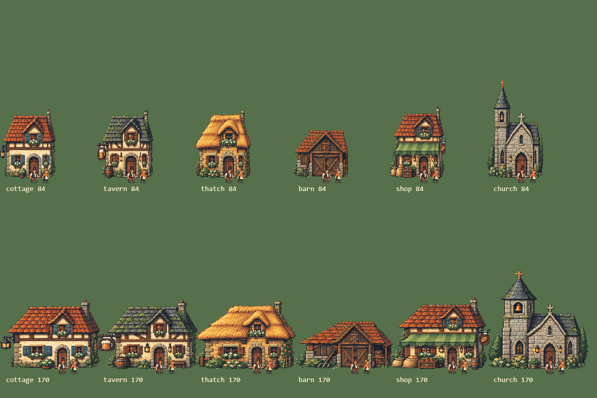
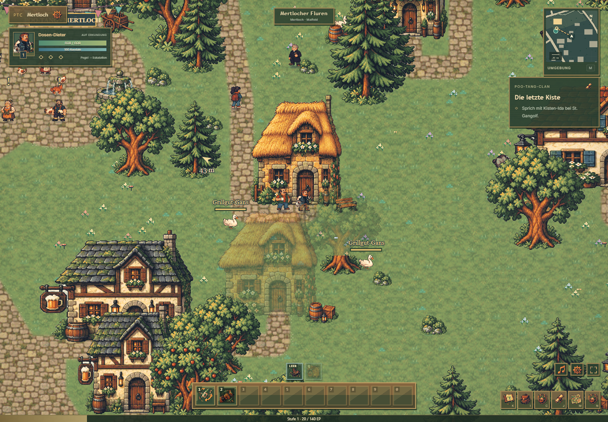
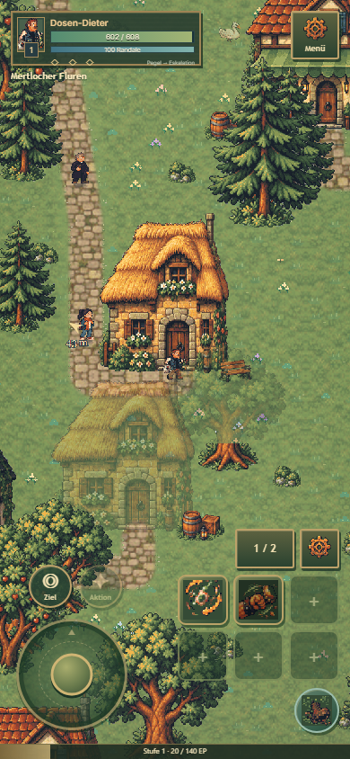
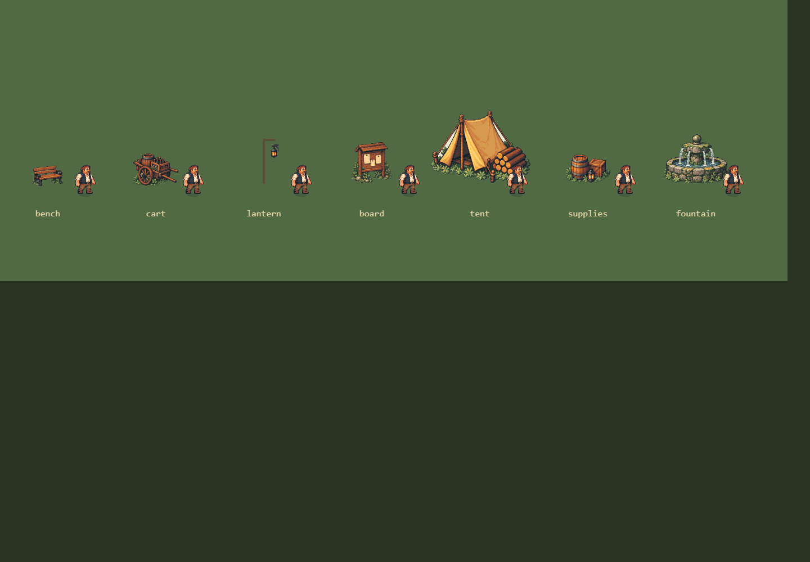

# Größenverhältnisse · 0.19.1

Die Gebäude wurden zuvor vollständig nach ihrer Kartenbreite skaliert. Türen, Fenster und Fassadenrequisiten schrumpften deshalb bei kleinen Grundflächen mit; außerdem lag die Türöffnung neben dem vom Generator berechneten Zugang.

`world-scale.js` ist jetzt die gemeinsame Referenz. Die Höhe eines Erwachsenen beträgt 26 Welteinheiten. Helden, Bewohner, Questgeber und gewöhnliche menschliche Gegner verwenden diesen Maßstab. Menschliche Bosse sind mit 29 etwas größer, der Automat mit 44 bewusst eine Maschine. Die getrennte Vergrößerung in Porträts und der Charakteransicht bleibt erhalten.

| Objekt | Höhe in Welteinheiten |
| --- | ---: |
| Normale Türöffnung | 35 |
| Kirchenportal | 42 |
| Scheunentor | 46 |
| Bank inklusive Lehne | 18 |
| Wagen inklusive Ladung | 29 |
| Laternenkörper ohne Mast | 13 |
| Anschlagtafel | 36 |
| Zelt | 64 |
| Vorratsstapel | 25 |

## Automatische Gebäuderegistrierung

Für alle sechs Gebäudegrafiken sind die tatsächlichen Türöffnungen im Originalatlas vermessen. Die Öffnung bestimmt die vertikale Skalierung. Der mittlere Streifen mit Tür und Rahmen bleibt proportional; die beiden äußeren Fassadenstreifen passen sich an die Breite der Grundfläche an. So bleibt ein schmales Haus schmal, ohne eine Puppenhausetür zu erhalten. Unterschiedliche Fassadenbreiten bleiben eine stilisierte Anpassung an die Karte.

Die Bildschwelle liegt auf `b.maxY`, die Türmitte auf `b.door.x`. Der bestehende begehbare Anlaufpunkt liegt zwölf Einheiten davor. Grafische Verdeckung verwendet dieselben neuen Bildgrenzen. Kartenkollisionen, Straßen und Pfade werden nicht versetzt. Neue Gebäudesprites benötigen eine vermessene Öffnung in `BUILDING_OPENINGS` und einen Sichtvergleich bei minimaler und maximaler Hausbreite.

Freistehende Requisiten verwenden im Dorf, auf Grundstücken und in Lagern dieselben Höhen. Die Tierdarstellung hat keinen zusätzlichen Verkleinerungsfaktor mehr für Dorfbewohner. Die bestehenden Höhen für Baumarten, Felsen, Brunnen und Tierarten wurden visuell mit Erwachsenen verglichen und beibehalten.

## Prüfung

- Alle sechs Gebäudetypen mit 84 und 170 Einheiten Breite neben Dieter und Anni betrachtet; Tests decken zusätzlich 120 und 172 ab.
- Alle 499 Hauseingänge im erzeugten Mertloch auf begehbare Anlaufpunkte geprüft.
- Im Browser vom Kirchplatz zum kleinen Reetdachhaus gelaufen: Ziel erreicht, Pfad abgeschlossen, Held vor der tatsächlichen Tür.
- Sichtprüfung Desktop 1440 × 1000 und Touchgerät 390 × 844; Mobilsteuerung automatisch aktiv.
- Vergleich von Bank, Wagen, Laterne, Anschlagtafel, Zelt, Vorräten und Brunnen neben dem Helden.
- `npm test`: 191 Tests bestanden, einschließlich drei neuer Maßstabstests und bestehender Generator-/Platzierungstests.

## Figurengröße: eine Stelle (23.09.2026)

Nutzerbefund: „Söldner, NPCs sind größer als der Held.“ Gemessen (Kopf bis Fuß, ohne Namensschild): Held 26 E, Söldner und andere Spieler 33 E (+27 %), Ida und die Stammgäste aus der Sprite-Schmiede 28,5–32 E (+10 bis +23 %). Die Präzisions-NPCs und Dorfbewohner lagen schon bei 25,75–27,25 E.

- **Maß:** `world-scale.js` → `WORLD_SCALE.adult` (26 E) und daraus `PERSON_SCALE = adult / FIGURE_BASE` (33 E ist die historische Grundhöhe der Zeichenwege `drawTinyPerson`/`drawLivePerson`/`drawClanHero`). Jede Menschenfigur in der Welt bekommt dieses Maß: Held, Söldner und andere Spieler (`renderer.js`, Zweig `other` – vorher ohne Maß, also 33 E), Ida, Questgeber, Hotspot-Geber und Stammgäste, Händler, Dorfbewohner, Kiosk, Berufslehrer.
- **Bildquellen:** Helden-, Präzisions- und Schmiede-Bögen tragen `worldHeight` (26 E). Die Schmiede zeichnet in der Schrägkamera die Tiefe mit, ihre Figuren sind im Bild ≈ 31 E hoch. `content-art.js` gleicht sie über die beim Laden gemessene Figurenhöhe (`paintedHeight`) ab, nicht über die Bildbreite.
- **Gewollte Ausnahmen:** Bosse (`WORLD_SCALE.boss`, Katalog 29–32 E); Trauzeuge Timo steht nach dem Kampf als Questgeber in seiner Boss-Figur (+22 %). Gegner und Tiere sind nicht Teil dieses Maßes.
- **Prüfung:** `npm run figures:check` (`scripts/figure-size-check.mjs`) misst alle Menschenfiguren über dieselben Zeichenwege mit den geladenen Bögen, gibt Welteinheiten und Bildschirmpixel für Dorf und Bude aus und bricht ab, wenn eine Figur mehr als ±5 % von der Heldenhöhe abweicht. Aufnahmen unter `visual-review/figure-size/`. `tests/figure-scale.test.mjs` hält fest, dass `renderer.js`, `kiosk-room-art.js` und `profession-art.js` keine eigene Größenrechnung haben.
